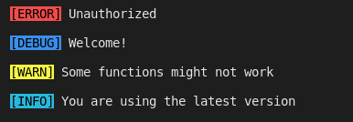

# lucid-log
A simple logger for nodejs applications.

This is at it's early stage of development and has very basic functionality. Please share your comments and suggestions, also report any bugs.

# Installation

`npm install lucid-log`

or 

`yarn add lucid-log`

# Usage

## Example 1:

```js

const { LucidLog } = require('lucid-log');
const logger = new LucidLog({
	levels: ['info','error','debug','warn']
});
logger.error('Unauthorized\n');
logger.debug('Welcome!\n');
logger.warn('Some functions might not work\n');
logger.info('You are using the latest version\n');

```

## Output


## Example 2:

```js

const { LucidLog } = require('.');
const logger = new LucidLog({
	levels: ['error','warn']
});
logger.error('Unauthorized\n');
logger.debug('Welcome!\n');
logger.warn('Some functions might not work\n');
logger.info('You are using the latest version\n');

```

## Output
